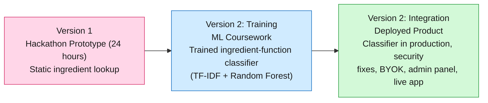

# CutisIQ: Skincare Ingredient Intelligence

CutisIQ analyzes skincare product ingredients and explains what each one actually does, replacing marketing claims with ingredient-level, personalized insight. This repository holds three stages of the same idea, each one built on top of the last.

## The Story

**Version 1: the hackathon prototype.** I built the first version in 24 hours at the Make-IT-Wright Hackathon 2026: scan a skincare product's ingredient list with your camera and understand what each chemical actually does, instead of a static database lookup. It won the "Most Likely to Ship" Award (Reynolds & Reynolds). This version has been live since the hackathon (around February 2026), and it's the same deployment that's been continuously extended ever since.
Full details: [version_1/README.md](./version_1/README.md)

**Version 2 (Training): the ML coursework project.** After the hackathon win, I wanted the ingredient lookup to be smarter than a static table, so I extended the idea into a graduate Machine Learning course project: training a real ingredient-function classifier on the EU's public CosIng cosmetic database, comparing several baseline models, and solving a class imbalance problem with a Class Sparsity Reduction strategy.
Full details: [version_2/v2_as_ML_finalproject/README.md](./version_2/v2_as_ML_finalproject/README.md)

**Version 2 (Integration): the deployed product.** Development continued well past the coursework, turning the trained model into a more powerful, production-ready system on that same live deployment: fixing OAuth buttons that didn't do anything, replacing a hardcoded admin password with real database-backed authorization, fixing a regulatory safety check that was silently failing to catch prohibited ingredients, retraining the classifier to fit on a free-tier host, building a scrape-and-Gemini fallback for ingredients the model doesn't recognize (clearly labeled, never presented as verified), adding per-user API key support, and standing up a dedicated ML backend on Render alongside the existing Vercel and Supabase setup.
Full details: [version_2/integration/README.md](./version_2/integration/README.md)

## Live App

- App: [cuties-iq.vercel.app](https://cuties-iq.vercel.app)
- ML backend: [cutis-iq-ml.onrender.com](https://cutis-iq-ml.onrender.com)

## Credits

| Stage | Contributors |
|---|---|
| [Version 1 (Hackathon)](./version_1/README.md) | Rishindra Mateti, Lohitha Donuri, Akanksha Padigapati, Varshitha Chennu, Mohith Kovvuri |
| [Version 2 (Training)](./version_2/v2_as_ML_finalproject/README.md) | Rishindra Mateti, Surya Thota, Tejaswi Reddy Kancharla |
| [Version 2 (Integration)](./version_2/integration/README.md) | Rishindra Mateti |
